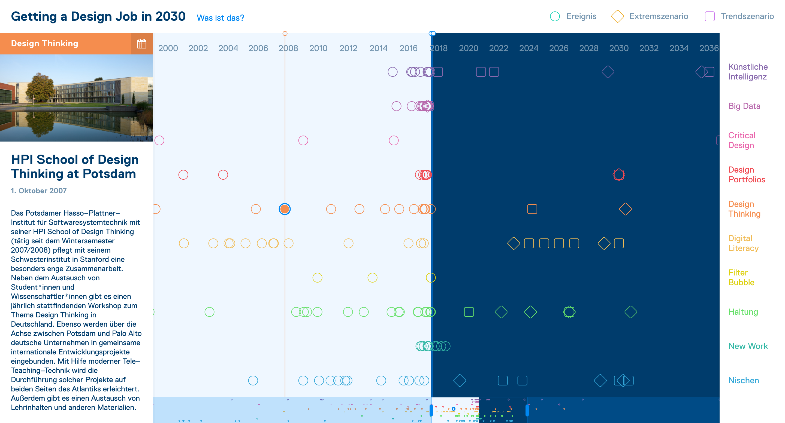

# [Design timeline](https://design-timeline.vogelino.com/) :clock2:

#### Install & develop
```sh
# Clone the repository
git clone git@github.com:vogelino/design-timeline.git && cd design-timeline

# Install dependencies
yarn install

# Develop
yarn dev

# Build for production
yarn buld

# Run tests
yarn test

# Lint scripts
yarn lint
```

## What is this?
This platform is a result of the seminar ["Getting a Design Job in 2030 - Why the design study has to change and which skills are already helpful today, in order to design responsibly"](https://fhp.incom.org/workspace/7200) done in the summer semester 2017 at the Design department of the [University of Applied Sciences of Potsdam](https://fh-potsdam.de).

[](https://design-timeline.vogelino.com/)

The platform visualizes the chronological development of important subject areas for the design disciplines in the past and develops scenarios for the future of the work of designers.

The course was attended by 34 students from all three design Bachelor's degree programs as well as from the Master's degree program of the Design department.

----

### The lecturers
- [Prof. Dr. Antje Michel](https://fhp.incom.org/profil/7508)
- [Prof. Dr. Frank Heidmann](https://fhp.incom.org/profil/220)

### The students
- [Adina Radke](https://fhp.incom.org/profil/4531)
<!-- - [Alex Wieland](https://fhp.incom.org/profil/5217) -->
- [Amelie Kirchmeyer](https://fhp.incom.org/profil/5657) - @ameliekirchmeyer
- [Anja Rauenbusch](https://fhp.incom.org/profil/6974)
<!-- - [Anna-Kristina Mohos](https://fhp.incom.org/profil/6357) -->
- [Bela Kurek](https://fhp.incom.org/profil/7123) - @q-rec
- [Christian Pflug](https://fhp.incom.org/profil/5732)
- [Christoph Rauscher](https://fhp.incom.org/profil/7868) - @christowski
- [David Röttger](https://fhp.incom.org/profil/5726) - @davidroettger
- [Edmundo Mejia Galindo](https://fhp.incom.org/profil/6600)
- [Elias Suske](https://fhp.incom.org/profil/5787)
- [Fabian Schultz](https://fhp.incom.org/profil/6306) - @fabe
<!-- - [Irina Maslennikova](https://fhp.incom.org/profil/4706) -->
- [Jasper Precht](https://fhp.incom.org/profil/5717) - @jasperp
- [Jens Rauenbusch](https://fhp.incom.org/profil/5187)
- [Jolanta Paliszewska](https://fhp.incom.org/profil/6264) - @vispalberlin
- [Joshua Pacheco](https://fhp.incom.org/profil/7029) - @joshpacheco
- [Kevin Schiffer](https://fhp.incom.org/profil/6275) - @kschiffer
- [Laura Pau Bielsa](https://fhp.incom.org/profil/7157) - @lpaubielsa
- [Lisa Kocht](https://fhp.incom.org/profil/4629)
- [Lucas Vogel](https://fhp.incom.org/profil/6438) - @vogelino - (me)
- [Ludwig Frank](https://fhp.incom.org/profil/7120) - @lfra
- [Maike Panz](https://fhp.incom.org/profil/5791)
- [Mario Klemm](https://fhp.incom.org/profil/5725)
<!-- - [Nina Komarova-Zelinskaya](https://fhp.incom.org/profil/7163) -->
- [Paul Klinski](https://fhp.incom.org/profil/6390) - @logetcrea
<!-- - [Paula Schuster](https://fhp.incom.org/profil/5198) -->
<!-- - [Pelle Dwertmann](https://fhp.incom.org/profil/5745) -->
<!-- - [Publina Sharma](https://fhp.incom.org/profil/6252) -->
- [Sabine Lehm](https://fhp.incom.org/profil/7188)
<!-- - [Tilo Krüger](https://fhp.incom.org/profil/5265) -->
- [Veronika Golyak](https://fhp.incom.org/profil/5700)

----

## Design & development
During a Design Thinking workshop organized by [Jens Rauenbusch](https://fhp.incom.org/profil/5187) we used different brainstorming techniques to find an idea about how to document our research and scenarios. During this small meeting, the idea of visualizing events, resources and scenarios on a timeline was first developed. Because of the ever-changing character of the debates and visions about the different topics discussed in the course, we felt like using a time-based visualization was the right format.

We built a small design team to create the first mockups of the visualization, including:
- [Bela Kurek](https://fhp.incom.org/profil/7123) - @q-rec
- [Joshua Pacheco](https://fhp.incom.org/profil/7029) - @joshpacheco
- [Laura Pau Bielsa](https://fhp.incom.org/profil/7157) - @lpaubielsa
- [Lucas Vogel](https://fhp.incom.org/profil/6438) - @vogelino - (me)
- [Paul Klinski](https://fhp.incom.org/profil/6390) - @logetcrea

We worked collaborativey using the UI-Design tool [Figma](https://www.figma.com/), and met a few times to discuss our mockups.
Once we agreed on a final design, I started implementing it with the help of [Paul Klinski](https://fhp.incom.org/profil/6390) using Javascript technologies such as [Redux](http://redux.js.org/) & [React](https://facebook.github.io/react/).

All students provided contents for the platform and developed scenarios.

The project was supervised by the two lecturers [Prof. Dr. Antje Michel](https://fhp.incom.org/profil/7508) & [Prof. Dr. Frank Heidmann](https://fhp.incom.org/profil/220).

The communication between teams was mostly coordinated by [Jens Rauenbusch](https://fhp.incom.org/profil/5187), who did a great job leading and guiding the members.
